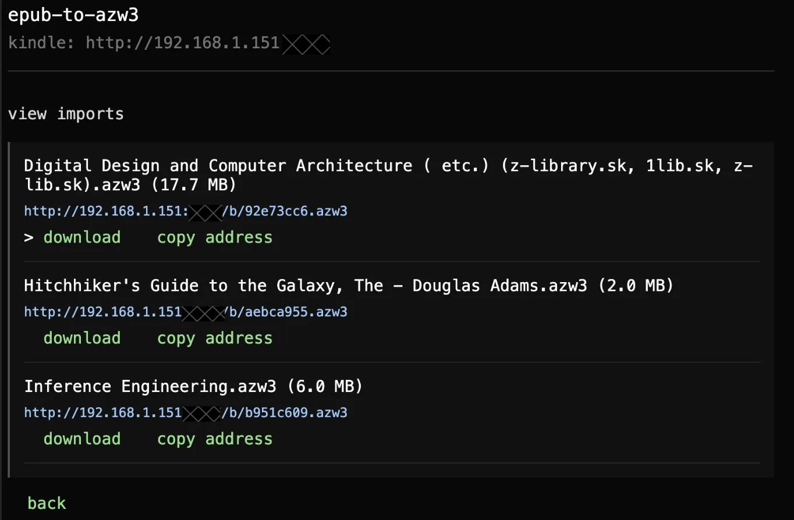

# EPUB to AZW3

Convert EPUB files to AZW3 on your Mac. The application keeps book files on your local network.
The application pins calibre 8.5.0 and uses its default conversion settings.

<p align="center">
  
  
</p>

## Requirements

- macOS
- Python 3
- An internet connection for the first setup only
- A Kindle and Mac on the same Wi-Fi network

## Set up the converter

Run the setup once:

```sh
cd ~/dev/epub-to-azw3
./setup
```

The setup downloads calibre 8.5.0 from the official calibre archive. It installs the application in the ignored `.tools` directory.

## Convert and transfer a book

1. Start the application:

   ```sh
   cd ~/dev/epub-to-azw3
   ./run
   ```

2. Use the Up Arrow and Down Arrow keys to move the `>` cursor.
3. Select `import .epub` and press Enter.
4. Select an EPUB file and wait for the conversion.
5. Open the displayed address in the Kindle web browser.
6. Select `view imports` to see prior conversions.
7. Stop the application with Control-C after the download.

The application stores generated files in the ignored `output` directory. It listens on port `8787` and serves only generated AZW3 files.

## Options

Use another port:

```sh
./run --port 9000
```

Do not open the Mac browser:

```sh
./run --no-open
```

Bind the application only to the Mac when Kindle access is not required:

```sh
./run --host 127.0.0.1
```

## Conversion engine

The application runs this conversion without extra options:

```sh
ebook-convert input.epub output.azw3
```

The calibre binary stays outside Git. calibre uses the GNU General Public License version 3.
